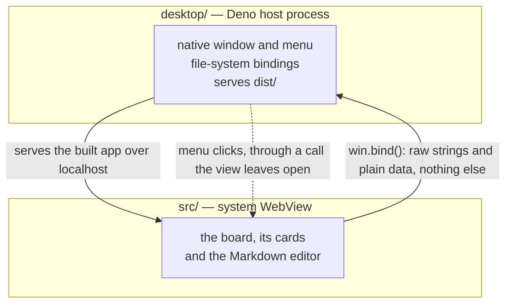

# Architecture

How Facet is put together, and why. If a change does not fit this shape, either
the change or this document is wrong, and it is worth deciding which before
writing more code.

It holds what is worth knowing before opening a file: the shape, the directions
things may flow, and the invariants that outlive any one implementation.

"Not written here" means "written closer to the code", not "not decided" — a
rule earns a place in this document only when no single file could own it.

## Two processes

A Deno host process owns the native window; the app runs in the system WebView.



The host is a thin I/O layer.

- It reads, writes, moves and lists files. It knows nothing about app features.
- That is what keeps the layering below meaningful: if the host parsed YAML on
  the way in, it would have to serialise it on the way out, and the domain model
  would end up split across the process boundary.

`win.bind()` only ever runs view → host. The one thing that starts on the host
side — a native menu click — comes back through a call the view leaves open
instead. `desktop/menuClickQueue.ts` and `infrastructure/denoApplicationMenu.ts`
hold what that costs.

The domain sits on the WebView side for two further reasons:

- Dragging a card has to update the board immediately, so the app holds the
  board in memory anyway. The operations on it belong where it lives.
- "Only files under the board's directory" is a product invariant, not a
  security boundary.
  - This is a single-user local app, so there's no reason to enforce it.

## Layers

| Layer             | May import                |
| ----------------- | ------------------------- |
| `domain/`         | nothing outside `domain/` |
| `usecase/`        | `domain/`                 |
| `infrastructure/` | `domain/`                 |
| `presentation/`   | `domain/`, `usecase/`     |
| `composition/`    | everything                |

Enforced by `.oxlintrc.json`, which also covers the `src/` ↔ `desktop/` split.

- Ports (`fileSystemPort`, `*Repository`) sit in `domain/` beside the entities
  that use them, rather than in a directory of their own.
- `usecase/` is one file per application operation, and `composition/` is the
  only place that builds a concrete implementation.
- `presentation` never imports `infrastructure`. It receives what it needs as a
  React context whose shape is declared in `presentation/context/appContext.ts`.
- `presentation` may instantiate application services whose lifecycle belongs to
  a store, such as `BoardSaveQueue`.
- Infrastructure-backed use cases are assembled in `composition/` and injected.

## The domain model

- Entities are plain data and every operation is a pure function returning a new
  value — `moveCard(board, from, to): Board`.
- Nothing is mutated in place, which suits "new reference means re-render" React
  model and makes the tests comparisons of input against output without mocks.

### Card identity

- A card's board-relative path is its identity. Operations that add or retarget
  a card reject a path another card already uses.
- Two paths can name one file without being the same string. `isSameCardPath` in
  `src/domain/boardPath.ts` defines that comparison, and why / what it folds.

## State

Stores are `create*` factories called once in `composition/dependencies.ts`
rather than module-level singletons, so nothing is built at import time and a
test can stand one up against fakes. They live in `src/presentation/store/`.

Board changes are applied optimistically and written back through
`BoardSaveQueue`, which coalesces overlapping changes and surfaces a failure as
a retryable error rather than rolling the board back.

Two things deliberately never reach the board file.

- `Card.fileState`: Whether a file exists is a fact about the file system, and
  copying it in would create a second source of truth. Facet does not watch for
  that as well, so the state is only ever as fresh as the last read.
- Filter criteria: What has been filtered to is a view of the board rather than
  a fact about it.

### Order of operations for anything destructive

```text
validate → file I/O → update the board optimistically → queue the save
```

The file goes first so a failure leaves the board exactly as it was; the reverse
order can drop the board's last reference to a file that failed to move or
delete. Two consequences:

- Uniqueness is checked **before** the file I/O, even though the domain would
  reject the collision afterwards anyway — otherwise the file has already moved
  to a path no card refers to.
- A card whose Markdown has a write in flight can be neither deleted nor moved.
  That write holds the path it started with, and would otherwise land after the
  move and recreate the file where it used to be.

### Recent boards

- Facet also persists `ConfigRepository` and what it keeps lives outside every
  board directory: it is state about the app, not content of a single board.
- Every step of that path degrades instead of failing, because losing the
  history must never stop a board opening.

## UI conventions

- Dialogs are native `<dialog>` elements driven by an `open` prop, with
  `showModal()` / `close()` in an effect. They carry a handful of rules that are
  easy to break and slow to diagnose.
- Read existing comments around the dialogs in `MarkdownViewer.tsx` and
  `KanbanBoard.tsx` and the grouped selectors in `src/presentation/App.css`.

## Errors

```text
domain / port:  a stable kind + what was being done
   → usecase:   UseCaseError { code, details, cause }
   → presentation: toUiError(error) → UiError { message, field? }
```

- Use cases put what the UI needs into `details` and keep the original as
  `cause`. Nothing is packed into a message for someone to parse back out.
- `presentation/errors/toUiError.ts` is the only place wording lives. A `field`
  tells a dialog which input to show the message next to.
- Anything that is not a `UseCaseError` is a bug rather than a user error: it is
  shown as a generic message, so paths and stack traces never reach the UI.
- Violated invariants throw a plain `Error`. They are not dressed up as
  recoverable failures.

## File-system safety

The host refuses rather than overwrites, and reports why as data rather than as
an exception, so the webview side can tell the cases apart. Each check sits
inside the same binding invocation as the call it guards — as narrow as the gap
can be made without an atomic primitive the runtime does not expose.

Creating, removing and renaming are each careful in a way the system call alone
does not explain. `desktop/fileSystem.ts` and `desktop/renameFile.ts` carry
that, and are kept out of `desktop/main.ts` so `deno test` can run them against
a real directory.
