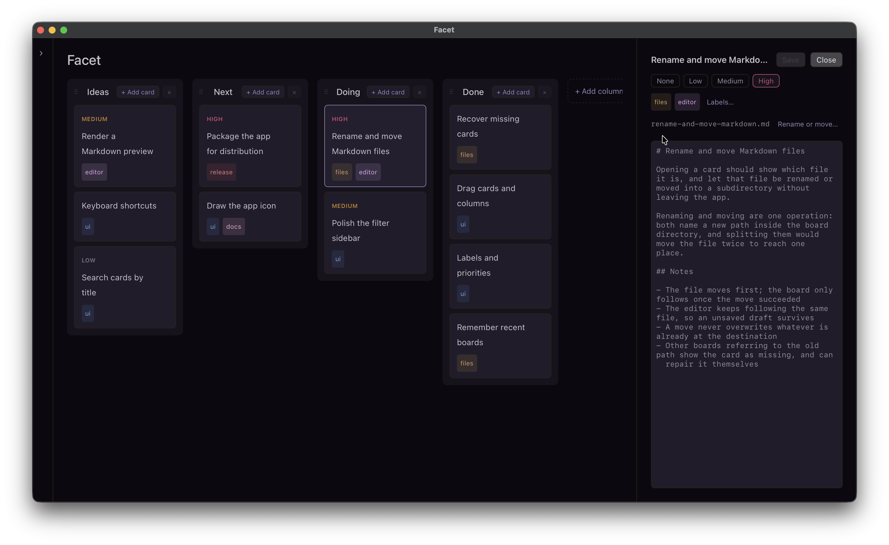

# Facet

A local-first Markdown kanban desktop app for macOS.

<p align="center">
  
</p>

- Opens a YAML board file and shows the Markdown files it references as cards
- Markdown files stay plain — no task-management metadata is written into them
- The same Markdown can sit on several boards, each with its own columns,
  priorities and labels

## On the board

- Drag cards between columns, and reorder them within a column
- Add, rename, reorder and remove columns
- Give a card a priority and any number of labels
- Filter by label and priority, or hide whole columns from view
- Search card titles or Markdown contents
- Create and open boards from the menu bar, including recently opened ones

## In the editor

Click a card to read and edit its Markdown beside the board.

- Plain text editing, saved back to the file the card points at
- Edit and GFM Preview modes, including tables, task lists and strikethrough
- The file's path is shown above the text, and the file can be renamed or moved
  into a subdirectory from there

## Files

A board and the Markdown it references live in one directory, and stay ordinary
files. Example:

```text
my-project/
├── ideas/
│   └── redesign-sidebar.md
├── improve-search.md
├── development.board.yaml
└── release.board.yaml
```

A board is a YAML file and cards are Markdown files anywhere at or below the
board's own directory. The directory, any subdirectories, and every file in them
can be named by you.

- Add a card by writing a new Markdown file, or by picking one already there
- Removing a card from a board and deleting its file are always separate choices
  - Deleting a Markdown file is permanent; Facet does not move it to Trash.
- If a file is moved, renamed or deleted outside the app, its card stays put and
  offers a way to point it back
- Facet does not watch files for external changes. If a board or open Markdown
  file changed after Facet loaded it, the next save reports a conflict and lets
  you reload or explicitly overwrite it.
- One board is open at a time — opening another replaces it in the same window.

## File format and automation

For the board file format, Markdown card behavior, path rules and guidance for
tools that modify Facet files directly, see the
[manage-facet-board skill](./.agents/skills/manage-facet-board/SKILL.md).

## Status

Facet targets **macOS only** and is built on
[Deno Desktop](https://docs.deno.com/runtime/desktop/), so it renders in the
system WebView rather than shipping a browser of its own.

## Getting started

Requires macOS and [Deno](https://deno.com/) 2.9.4 or newer.

```sh
deno install          # install the dependencies
deno task desktop     # build the app bundle
open Facet.app        # launch it
```

`deno task desktop` only builds `Facet.app`; it does not start the app.

Recently opened boards are remembered in
`~/Library/Application Support/Facet/config.yaml`.
